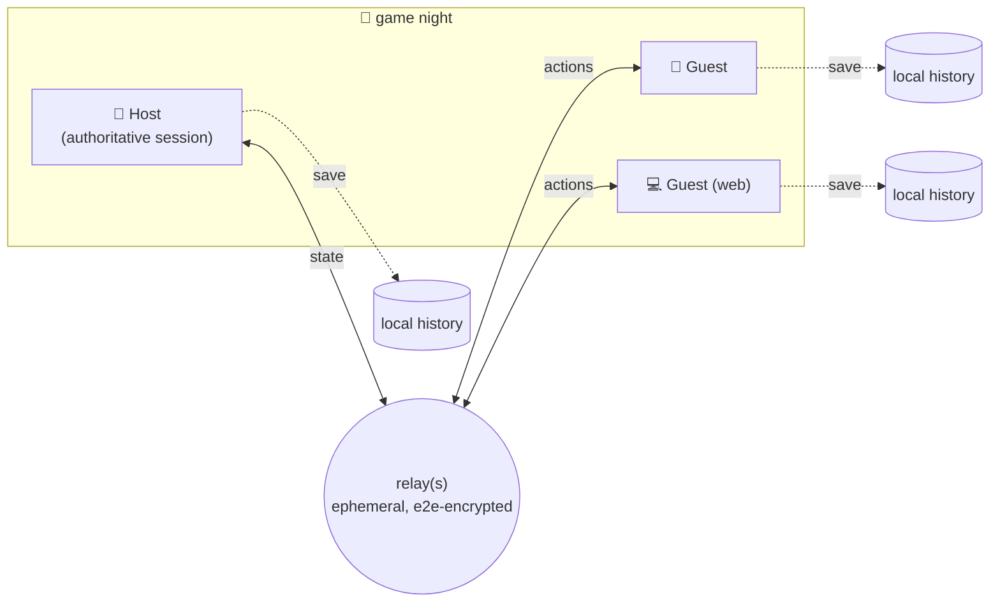

# Jamez

Jamez is a peer-to-peer score tracker for board & card game nights. One person **hosts** a session on their phone or browser, everyone else **joins in seconds** with a 6-letter code or a QR scan: no accounts, no sign-ups, no server holding your data. Players submit their own scores from their own devices, results sync live at the table, and every finished game is saved to **each player's own device**.

| | |
|---|---|
| 🌐 **Web app** | React + Vite + Tailwind 4, shadcn-style UI, deployed to GitHub Pages |
| 📱 **iOS app** | Expo + React Native + NativeWind, shipped to TestFlight via GitHub Actions |
| 🧠 **Shared core** | One TypeScript engine (`@jamez/core`) powers both apps |
| 🎮 **Games** | Wingspan 🐦, Gin Rummy 🃏, Poker Bank 🪙; engines are pluggable |

## How it works

- **The host is the authority.** The host device runs the game session, validates every score submission, and broadcasts authoritative state. Guests are thin: they render state and send actions.
- **Sessions are rooms on a message bus.** Devices exchange messages through [Nostr](https://nostr.com) relays as *ephemeral* events (kind 20808); relays fan them out to live subscribers and **never store them**. This works across networks (cellular ↔ home wifi) with zero infrastructure of our own.
- **Everything is end-to-end encrypted.** The join code is a shared secret: each room derives an XChaCha20-Poly1305 key from it (HKDF-SHA256) and a public room topic hash. Relays and eavesdroppers see only ciphertext on an opaque topic; only people who know the code can read or write the room.
- **Stats live on your devices.** When a game finishes, each participant's device writes the result to its own local history (`localStorage` / `AsyncStorage`). There is no central database; deleting your history is genuinely deleting it.
- **Works with zero connectivity too.** *Pass & Play* mode runs a whole game on the host device, and `@jamez/relay` is a tiny NIP-01 relay you can run on a laptop for fully offline LAN game nights (point both apps at it in Settings).



## Repo layout

```
packages/core     @jamez/core   session protocol, crypto, transports, game engines, history/stats
packages/relay    @jamez/relay  tiny in-memory NIP-01 Nostr relay (LAN play, dev, tests)
apps/web          @jamez/web    Vite + React 19 + Tailwind 4 web app
apps/mobile       @jamez/mobile Expo (iOS-first) app with expo-router + NativeWind
e2e/              Playwright smoke test: two real browsers play full games over a real relay
.github/workflows CI, GitHub Pages deploy, iOS TestFlight release (macOS runner)
```

## Quick start

Requires **Node 20+** and **pnpm 10** (`corepack enable`).

```bash
pnpm install
pnpm dev          # builds core, then serves the web app at http://localhost:5173
```

Open the app in two browser windows (or your phone + laptop), host a game in one and join with the code from the other.

Mobile:

```bash
pnpm --filter @jamez/core build
cd apps/mobile
pnpm start        # Expo dev server; press i for the iOS simulator, or scan with Expo Go
```

Fully offline / LAN game night:

```bash
pnpm relay        # prints ws://<your-lan-ip>:7447
```

Then in the app: Settings → paste that `ws://…` URL as a custom relay (web also accepts `?relay=ws://…` in the URL).

## Testing

```bash
pnpm test         # vitest: engines, crypto, session protocol, transport over a real local relay
pnpm typecheck    # strict TS across every package
node e2e/smoke.mjs  # after `pnpm build`: 2 headless browsers play Wingspan + Gin Rummy end-to-end
```

The e2e run drops screenshots of every step in `e2e/artifacts/`. CI runs all of the above plus a Metro export of the iOS bundle on every PR.

## Deploying the web app (GitHub Pages)

Already wired: `.github/workflows/deploy-web.yml` builds and publishes on every push to `main`.

One-time setup: repo **Settings → Pages → Source: GitHub Actions**. Deployed at **https://playjamez.com** (custom domain on GitHub Pages). QR codes and join links point there automatically (a `404.html` fallback keeps `/join/CODE` deep links working).

`VITE_BASE` is `/` in `.github/workflows/deploy-web.yml` for the custom domain. Mobile QR codes use `extra.webAppUrl` in `apps/mobile/app.config.ts` (`https://playjamez.com`).

## iOS releases (TestFlight)

Same flow as Sous Kit: `.github/workflows/ios-release.yml` on a **macOS** runner: `expo prebuild` → `xcodebuild` → TestFlight. No Expo/EAS. Setup walkthrough (Apple + secrets): **[`docs/ASC_Setup.md`](docs/ASC_Setup.md)**.

Triggers on `main` pushes that touch `apps/mobile/**` or `packages/core/**`, or *Actions → iOS release*. Bundle id `com.joelyoung.jamez` · scheme `jamez://join/CODE` (QR codes use the web URL so people without the app land in the browser).

## Adding a game

Games are plug-ins in three parts. The whole of Wingspan is ~200 lines of engine + one UI file per app:

1. **Engine** (`packages/core/src/games/<game>.ts`): implement `GameEngine`: a pure, serializable state machine (`defaultConfig / init / validateAction / applyAction / isFinished / summary`). Optional: `sessionMode: 'ongoing'` for long-lived rooms, plus `claimSeat` / `mergePlayers` when seats can transfer. The host runs it; guests never need game logic to submit actions. Register it in `games/registry.ts` and add a test file next to it. Host snapshots are vaulted under `${gameId}:${CODE}` so plugins stay isolated.
2. **Web UI** (`apps/web/src/games/<game>.tsx`): a `GameUIModule` with a `SetupForm` (host options), `PlayView` (score entry + live standings) and optional `ResultsDetail`. Register in `apps/web/src/games/registry.ts`.
3. **Mobile UI** (`apps/mobile/src/games/<game>.tsx`): same module shape in React Native. Register in `apps/mobile/src/games/registry.ts`.

Design rule of thumb: guests may edit **their own** scores (`validateAction` enforces it), the host may edit anyone's (great for scoring for the player who wandered off to refill snacks).

## Current games

- **🐦 Wingspan:** full end-game score sheet (birds, bonus cards, end-of-round goals, eggs, cached food, tucked cards + optional Oceania nectar), live standings, official tie-breaker (unused food).
- **🃏 Gin Rummy:** hand-by-hand recorder (knock / gin / big gin / undercut with configurable bonuses), running totals to a target score, boxes, and the official final tally with line bonuses.
- **🪙 Poker Bank:** long-running chip bank (`sessionMode: 'ongoing'`). Starting stacks, deposit/withdraw with chip breakdowns, host-configured chip colors, guest seats that real devices can claim, and account merges. Host can park & resume across nights; state is stored in a game-scoped host vault.

## Roadmap ideas

- Direct WebRTC data channels (relay becomes signaling only) and Bluetooth/mDNS discovery for true serverless LAN play
- Host entitlements (the "host is the paid user" model; guests always free)
- More games: Scrabble, Yahtzee, Hearts, Farkle, Azul…
- Shared long-term leagues: signed, portable stat exports players can merge
- Dedicated iCloud/CloudKit sync for host vaults (device backups already cover AsyncStorage)
